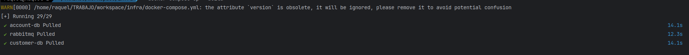
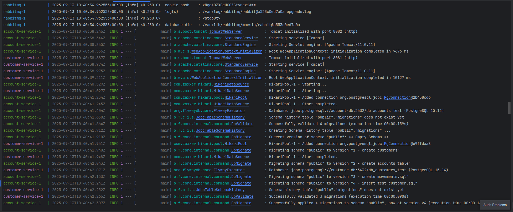
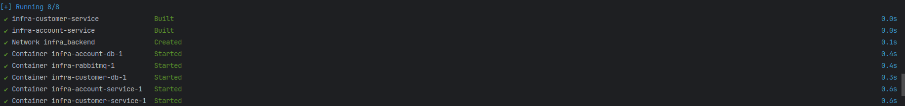
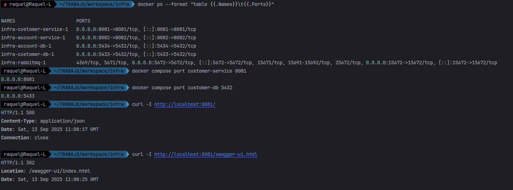
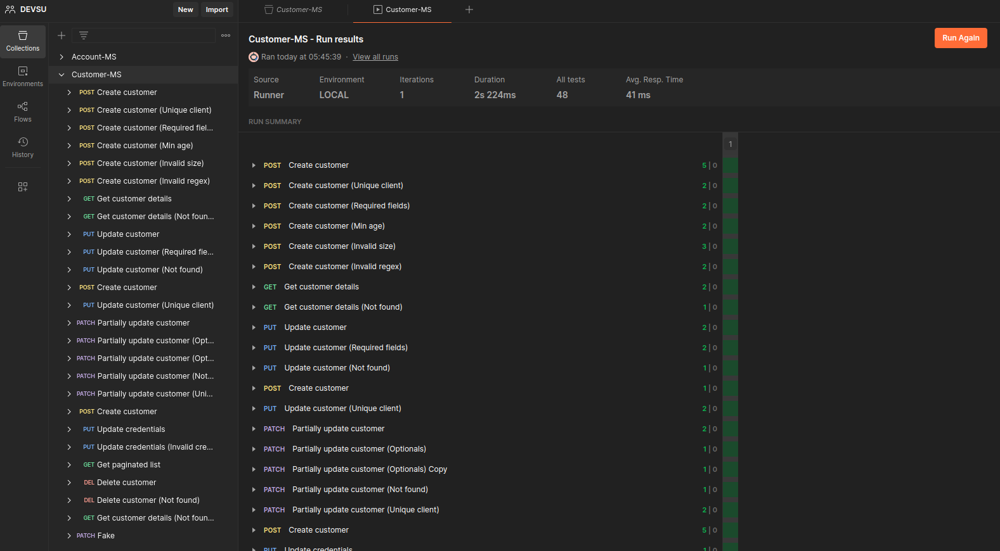
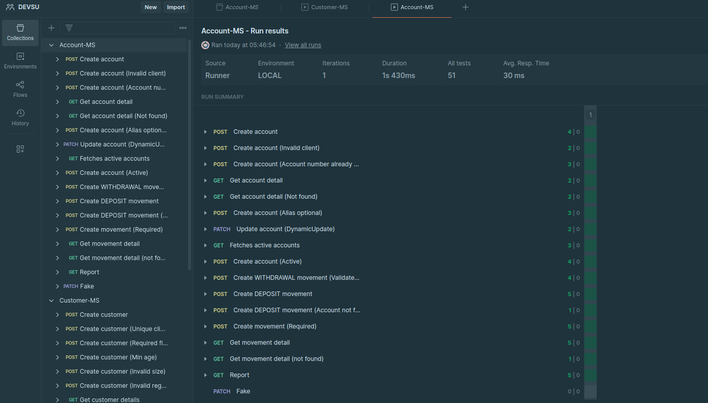
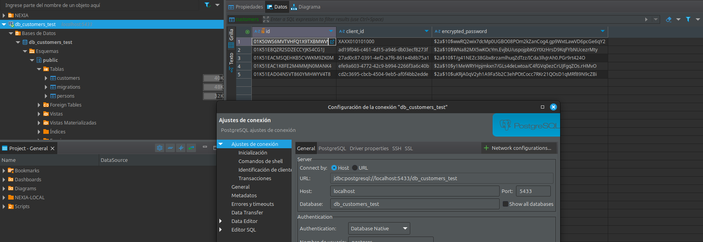
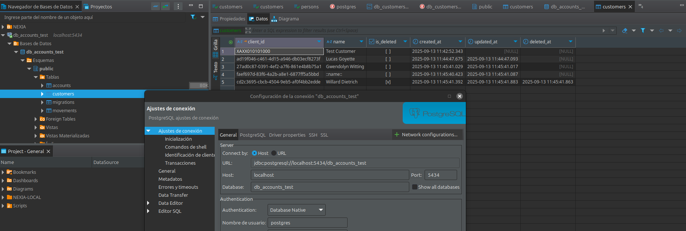

# F7 Despliegue de la solución
En este archivo se describe cómo hacer el despliegue de los microservicios: **customer-service** y **account-service** 
base de datos y servidor de mensajería **rabbit** empleado para la comunicación **asyn**

### Setup del proyecto con docker
1. Puede clonar el repo `infra` desde: 
[git@github.com:grleyvaj/infra.git](git@github.com:grleyvaj/infra.git)


2. Construir los jars (en cada microservice):

  ```bash
    # desde ../customer-service
    cd ..
    cd customer-microservice
    mvn clean package -DskipTests
  ```
  ```bash
    # desde ../account-service
    cd ..
    cd account-microservice
    mvn clean package -DskipTests
  ```  

3. Dar permisos de escritura a los archivos de creación de BD que ejecuta docker
   ```bash
   cd infra
   ls -l
   ls -l customer-db-init      
   chmod 644 customer-db-init/*.sql
   ```
   
   ```bash
   cd infra
   ls -l
   ls -l account-db-init      
   chmod 644 account-db-init/*.sql  
   ```
   
3. Desde infra realizar el arranque con:
  ```bash
    cd ..
    cd infra
    docker compose up --build
   ```

4. Compruebe:
    - Consola de rabbit
   
       RabbitMQ UI: http://localhost:15672
       
       user/pass: guest/guest por defecto
    
    - Microservicio Customer 
 
       customer-service: http://localhost:8081
       
       swagger: http://localhost:8081/swagger-ui/index.html#/
    
    - Microservicio Account:
    
        account-service: http://localhost:8082
       
        swagger: http://localhost:8082/swagger-ui/index.html#/

Al realizar el arranque y completar se desplegaron correctamente rabbit y los microservicios:





Puede emplear los siguientes comandos y CURLs para comprobar que rabbit, db y microservicios levantaron correctamente
### Comprobaciones

```bash
   docker compose ps
   docker compose port customer-service 8081
   docker compose port customer-db 5432
```

```bash
   curl -I http://localhost:8081/
   curl -I http://localhost:8081/swagger-ui.html
   curl -I http://localhost:8081/api-docs
```



Se ejecutaron los test 100%

API de Customers


API de Accounts Movements


Con los test en la BD de customer `db_customers_test` se dieron de alta todos estos customers


   

Para comprobar que los eventos de rabbit se publicaron/consumieron correctamente, checo en ld BD de accounts y efectivamente se encuentran sincronizados
